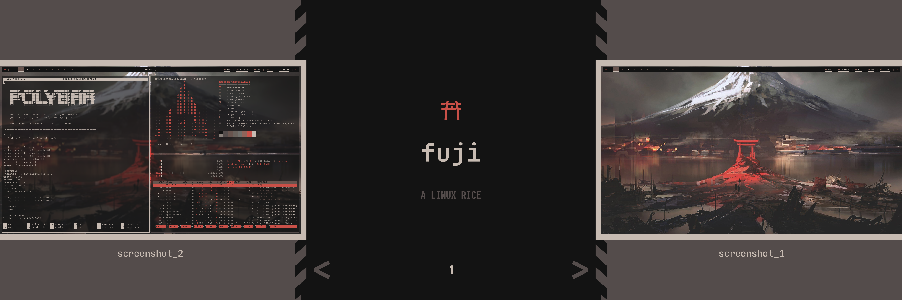

# .fuji

## Arch Linux

## Setup:
- Colors: pywal (`wal -i fuji.jpg` should apply colors)
- Bar: Polybar
- Terminal: Alacritty
- Shell: Bash
- WM: bspwm
- Hotkeys: sxhkd
- Launcher: Rofi
- Font: JetBrains Mono Nerd Font

## Screenshots

## Commands shown in screenshots:
- neofetch
- htop
- nano

## Credits:
- Wallpaper: Sparth. Original blog post: http://sparthconstruct.blogspot.com/2011/03/images-for-japan-des-images-pour-le.html
